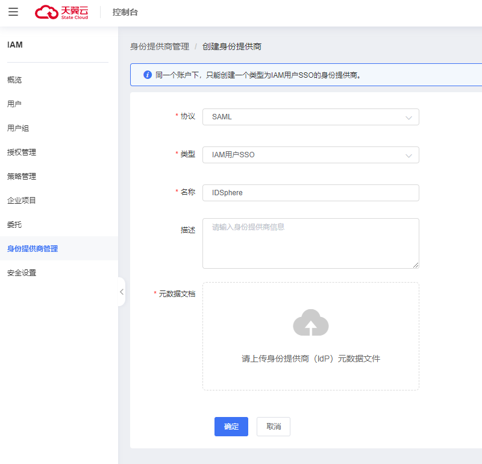
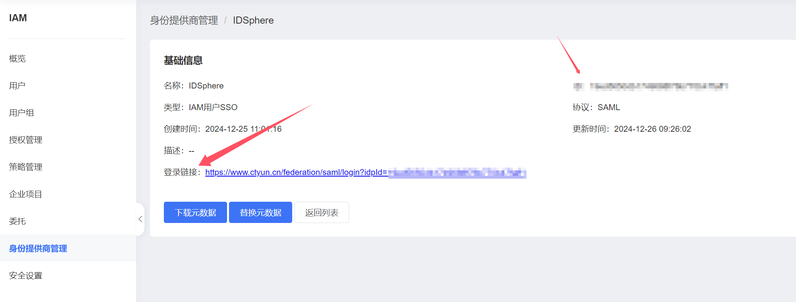
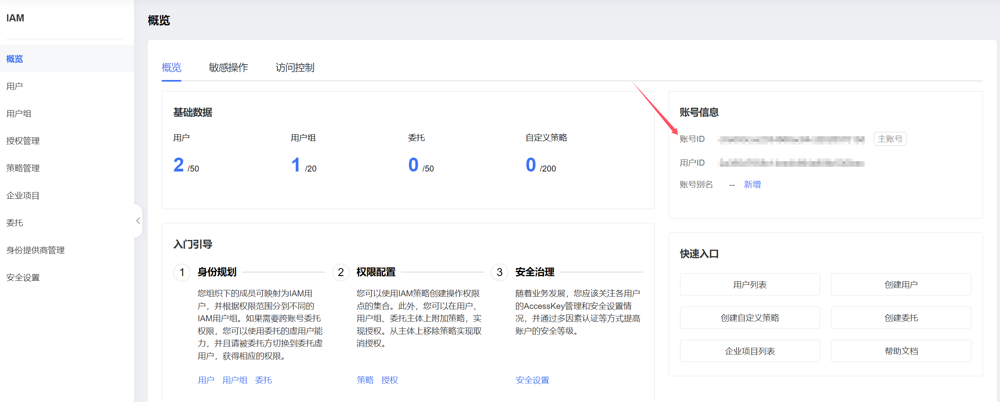
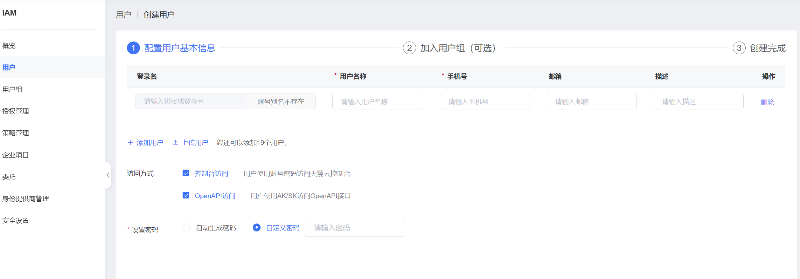
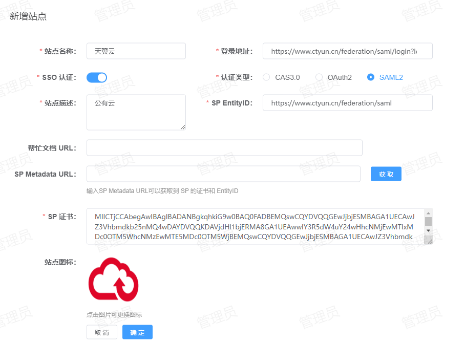
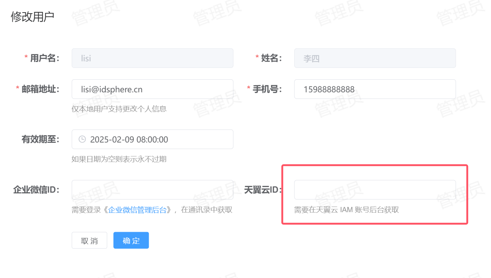

# 天翼云单点登录
支持的单点登录方式：SAML2
## 配置方法
1. **创建身份提供商**：登录天翼云，进入【统一身份认证】-【身份提供商管理】-【创建身份提供商】如下所示：  
  
   * 协议：选择`SAML`。
   * 类型：建议使用 `IAM用户SSO`，需要创建 IAM 实体用户。
   * 名称：指定一个名称，便于用户区分。
   * 描述：描述信息。
   * 元数据文档：IDP的元数据文件可以访问 IDSphere 统一认证平台获取，地址为：`<externalUrl>/api/v1/sso/saml/metadata`。  
2. **获取身份提供商 ID**：创建完身份提供商后点击【查看】，如下所示：  
  
   上图中的 `ID` 就是身份提供商 ID，需要将该 ID 和登录链接保存下来，后续在注册站点时需要使用。  
3. **获取账号 ID**：点击【概览】，如下图所示：  
  
   箭头所指的 ID 就是账号 ID，需要将该 ID 保存下来，后续在注册站点时需要使用。  
4. **创建 IAM 账号**：点击【用户】-【创建用户】，如下所示：  
  
   按要求填写用户信息，完成创建即可，需要注意的是用户名称和 IDSphere 统一认证平台中的用户姓名需要对应。  
5. **站点注册**：登录到平台，点击【资产管理】-【站点管理】-【新增】将天翼云站点信息注册到平台，配置如下所示：  
  
   * 站点名称：指定一个名称，便于用户区分。
   * 登录地址：天翼云的登录地址，该地址从`第2步`获取。
   * SSO 认证：启用。
   * 认证类型：选择 `SAML2`。
   * 站点描述：描述信息。
   * SP Metadata URL：填写 [天翼云元数据访问地址](https://iam.ctyun.cn/files/ctyun-federation-sp-%E7%94%9F%E4%BA%A7%E7%8E%AF%E5%A2%83.xml "天翼云元数据访问地址")相关信息，由于无法自动从天翼云元数据中加载`SP EntityID`和`SP 证书`相关信息，所以需要手动填写。  
6. **站点修改**：登录到 IDSphere 统一认证平台数据库，在 `site` 表中找到刚注册的站点信息，需要修改 `domain_id` 和 `idp_name` 这两个字段。  
   * domain_id：对应`第3步`获取的账号 ID。
   * idp_name：对应`第2步`获取的身份提供商 ID。  
7. **用户绑定**：在 IDSphere 统一认证平台中找到对应的用户信息，点击【编辑】，如下图所示：  
  
   需要将天翼云对应 IAM 账号 ID和 IDSphere 统一认证平台的账号进行一个绑定，使用的就是`第4步`创建的 IAM 账号 ID，该 ID 在创建完用户后可以在账号列表中获取。